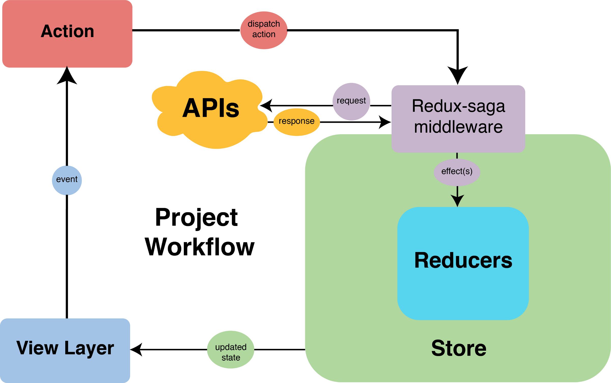

# React Typescript Prototype Architecture

This project is used to prototype my preferred architecture and best practices for any of my **React Typescript** projects.

**Typescript** is now my go to general purpose language now after being a full-stack Java + JS developer for years. If you are a JavaScript purist, that's ok, but don't expect this project to be very useful. Regardless, I'm in the camp that Typescript offers front-end projects the best long-term gains for virtually zero extra effort up front (at least for newer projects). Unless you're writing an extremely simple app that you intend to never touch again, [TypeScript will save you or organization endless struggle understanding, debugging, or refacting code.](https://medium.com/@jtomaszewski/why-typescript-is-the-best-way-to-write-front-end-in-2019-feb855f9b164)

**React** ...

- ["We should use React because it lets you write code in JSX. It provides code re-usability and lets you control the unnecessary rendering of components."](https://medium.com/@abhinav_jain123/react-redux-architecture-part-1-separation-of-concerns-812da3b08b46)

# Getting started with Create React App Typescript

This remainder of this document describes how to install the tools & standards I chose to implement alongside React.

I chose to bootstrap the project using [Create React App with Typescript](https://create-react-app.dev/docs/adding-typescript).

`npx create-react-app my-app --template typescript`

Technically, this step is optional if you've already setup a basic React project. However, if you're new to React or are starting a new project, then give it a shot. You can always change your mind and "eject" it from your application, which will copy all of the configuration and transitive dependencies (webpack, Babel, ESLint, etc) directly into your project for full control.

# Folder Structure

For state modularization purposes, we will follow feature-based folder structure approach, a.k.a. Ducks.

See also:

- Screaming Architecture - https://khalilstemmler.com/articles/typescript-domain-driven-design/ddd-frontend/#Screaming-architecture--package-by-module-and-subdomain
- Re-ducks Architecture - https://www.freecodecamp.org/news/scaling-your-redux-app-with-ducks-6115955638be/

# Redux

## [React + Redux Architecture: Separation of Concerns](https://medium.com/@abhinav_jain123/react-redux-architecture-part-1-separation-of-concerns-812da3b08b46)

1. We should use React because it lets you write code in JSX. It provides code re-usability and lets you control the unnecessary rendering of components.

2. Use Redux because it provides a “unidirectional data flow.” This helps to manage and organize data better and makes debugging a lot easier.

3. React should only render HTML content, have multiple UI states, dispatch actions on user interaction, and perform animations.

4. React shouldn’t request data if it’s not present. It shouldn’t dispatch actions in a component’s life cycle events if the action is not directly related to the life cycle event.

5. Redux has 3 parts: Actions, Reducers, and Store. I have put the concerns into 2 groups:

   - Brain — This will use only the Actions part of Redux
   - Storage — This will use Reducers and StoreBrain comprises functionalities which define your application.

6. It includes:

   - Business Logic
   - Handling routes
   - API Calls
   - Authentications
   - Validations
   - Controlling component’s state

7. Storage will contain reducers (pure functions) and a single object called store which will save your application state. The only way to change its state is by dispatching an action.

## [Scalable Redux architecture with Redux-Saga](https://itnext.io/scalable-redux-architecture-for-react-projects-with-redux-saga-and-typescript-f6afe1dece9b)

### Install Dependencies

TODO update versions

`npm i redux@4.0.4 react-redux@7.1.0 redux-saga@1.0.5 redux-saga-test-plan@4.0.0-beta.4 typesafe-actions@4.4.2 enzyme@3.10.0 redux-mock-store@1.5.3 enzyme-adapter-react-16@1.14.0 @reduxjs/toolkit`

### Install Development Dependencies

`npm i -D @types/react-redux@7.1.1 @types/enzyme@3.10.3 @types/redux-mock-store@1.0.1 @types/enzyme-adapter-react-16@1.0.5`

### Integrate Redux into the project

## [Redux Best Practices - Redux style guide for writing redux code](https://redux.js.org/style-guide/style-guide)

There are categories of essential, strongly recommended, and recommend patterns and best practices to follow.

### **_Essential_**

1. **_Do Not Mutate State_**
   - Mutating state is the most common cause of bugs in Redux applications, including components failing to re-render properly, and will also break time-travel debugging in the Redux DevTools. Actual mutation of state values should always be avoided, both inside reducers and in all other application code.
   - Use tools such as redux-immutable-state-invariant to catch mutations during development, and Immer to avoid accidental mutations in state updates.

2) **_Reducers Must Not Have Side Effects_**
   - Reducer functions should only depend on their state and action arguments, and should only calculate and return a new state value based on those arguments. They must not execute any kind of asynchronous logic (AJAX calls, timeouts, promises, generate random values (Date.now(), Math.random()), modify variables outside the reducer, or run other code that affects things outside the scope of the reducer function.
3) **_Do Not Put Non-Serializable Values in State or Actions_**
   - Avoid putting non-serializable values such as Promises, Symbols, Maps/Sets, functions, or class instances into the Redux store state or dispatched actions. This ensures that capabilities such as debugging via the Redux DevTools will work as expected. It also ensures that the UI will update as expected.

### **_Recommended_**
